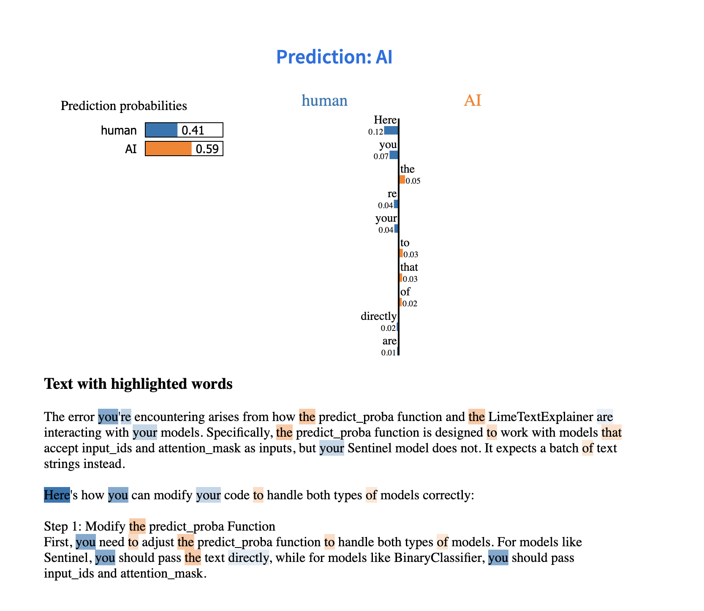
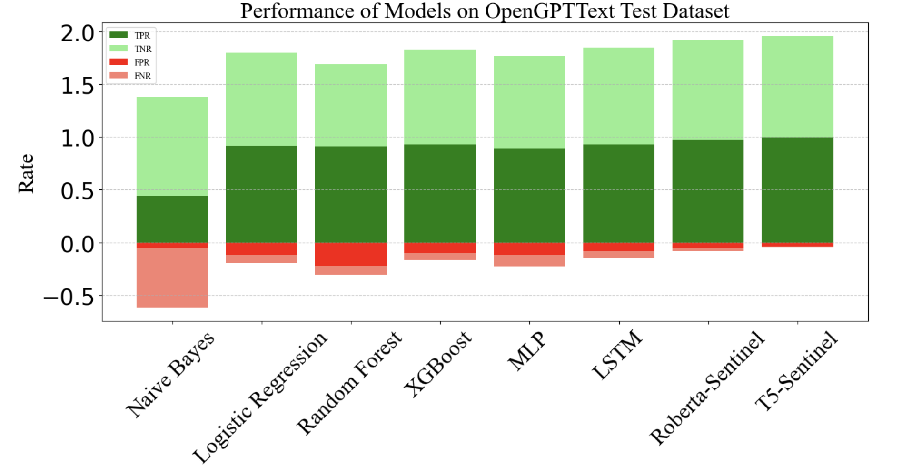

# HULLMI: Human vs. LLM Identification with Explainability

*"HULLMI: Human vs. LLM Identification with Explainability."* This repository contains the datasets used in our study and the code used for various machine learning models.

## Getting Started

### Prerequisites
- **Python Version**: This project requires Python 3.8. Ensure you have it installed on your system.
- **Dependencies**: Install the required packages by running:

### Hosted Website
The project is hosted online and can be accessed at:

https://e483-128-194-35-50.ngrok-free.app/

*Caption: A screenshot of the hosted website interface.*

## Repository Contents

### Datasets
The datasets used for our study, including the curated dataset, are available in this repository.

### Traditional Machine Learning Models
The code for traditional machine learning models (excluding LSTM) can be found in the `HuLLMI_Paper_ML_Traditional_Model.ipynb` notebook, which you can access by downloading the provided ZIP file.

### Advanced Deep Learning Models
For LSTM, T5-Sentinel, and RoBERTa-Sentinel models, refer to the `LSTM_T5_Sentinel_and_Roberta_Sentinel_T5_Sentinel_ROC_DET.ipynb` notebook.
For detailed code snippets of the RoBERTa-Sentinel model, check the `HuLLMI_Roberta_Sentinel_.ipynb` notebook.

### Plot Generation
We've included additional code snippets used for plot generation. Please review the relevant sections for more details.

### Detailed Samples
As mentioned in the paper, detailed samples can be found within this repository.

*Caption: Performance metrics of the models used in the study.*

### Viewing LIME Plots
To view the LIME plots from our study, please open the notebooks in Google Colab or Jupyter Notebook.

